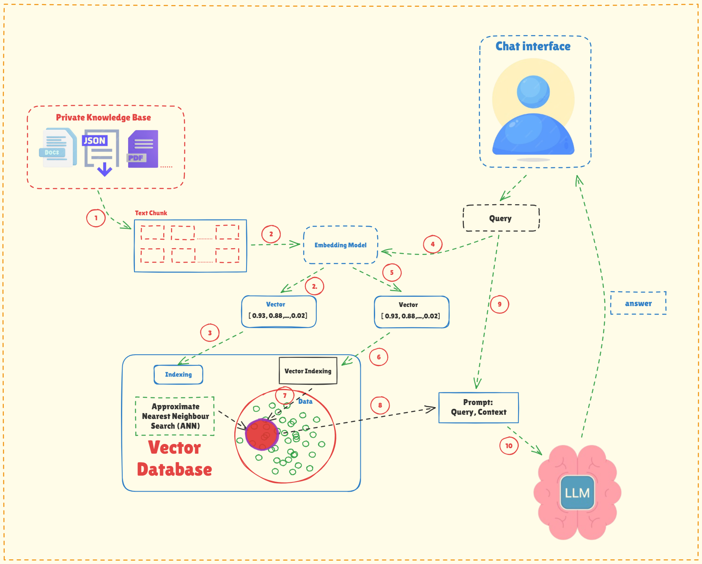

<h1 align="center">🤖 FlowAssist-Chatbot 🤖</h1>

<p align="center">
Chatbot thông minh sử dụng Retrieval-Augmented Generation (RAG) kết hợp với LLM để cung cấp câu trả lời chính xác dựa trên tài liệu nội bộ của doanh nghiệp.
</p>

---
### Kiến trúc tổng quan


### 📁Cấu trúc dự án
```
FlowAssist-Chatbot/
├── api/                       # API layer (FastAPI)
│   ├── main.py
│   ├── health.py
│   └── routes/
│       ├── chat.py
│       ├── rag.py
│       └── health.py
│
├── rag/                       # Retrieval-Augmented Generation pipeline
│   ├── ingestion/
│   │   ├── loader.py
│   │   └── chunking.py
│   ├── embedding/
│   │   └── embedder.py
│   ├── retrieval/
│   │   └── retriever.py
│   ├── vectorstore/
│   │   ├── tidb.py
│   │   └── upsert.py
│   └── pipeline.py
│
├── llm/                       # LLM integration
│   ├── generator.py
│   └── prompt.py
│
├── core/                      # Shared utilities
│   ├── schema.py
│   ├── logging_setup.py
│   └── setting_loader.py
│
├── config/
│   ├── settings.yaml
│   └── logging.yaml
│
├── data/                      # Documents / datasets
├── logs/                      # Runtime logs
├── README.md                  # Project documentation
├── .env                       # Environment variables
├── .gitignore
├── Dockerfile                 # Container image
├── docker-compose.yaml        # Service orchestration
└── requirements.txt           # Python dependencies
```

### 🔎LIÊN HỆ
---
📧 Email: ndtoan.work@gmail.com

💼 LinkedIn: https://www.linkedin.com/in/ndtoanwork/

📍 Location: Binh Thanh, Ho Chi Minh City, Vietnam.

Cảm ơn bạn đã ghé thăm dự án của tôi!